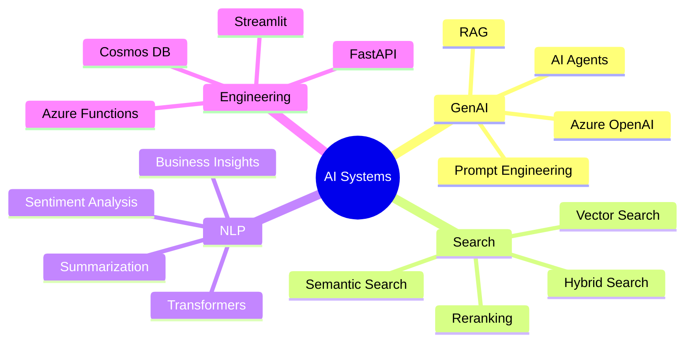
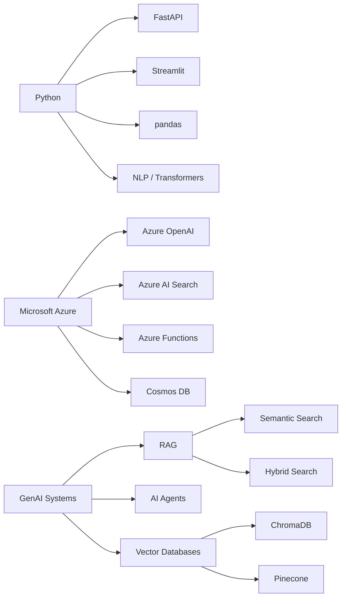

<!--
Profile README for CKRG2001
Recommended repo name: CKRG2001/CKRG2001
Recommended assets folder:
assets/
  ├── demo.gif
  ├── architecture.png
  ├── screenshot-results.png
  ├── recruiter-assistant-demo.gif
  ├── recruiter-assistant-architecture.png
  ├── mcdonalds-nlp-dashboard.png
  └── mcdonalds-nlp-insights.png
-->

<h1 align="center">Hi, I'm Chaitanya Reddy 👋</h1>

<h3 align="center">
AI Engineer / Data Scientist building GenAI systems with RAG, AI Agents, Azure OpenAI, Semantic Search, FastAPI, and NLP
</h3>

  

  
  
  
  

---

## 🚀 About Me

I build **production-oriented AI and data systems** that combine LLMs, retrieval, semantic search, NLP, APIs, and cloud services.

My work focuses on turning unstructured text into useful decision systems: recruiter assistants, resume intelligence, customer review analytics, semantic search apps, RAG pipelines, AI agents, and NLP dashboards.

I am especially interested in roles such as:

<table>
<tr>
<td>🤖 AI Engineer</td>
<td>🧠 GenAI Engineer</td>
<td>⚙️ Applied AI Engineer</td>
</tr>
<tr>
<td>📊 Data Scientist</td>
<td>🧪 Machine Learning Engineer</td>
<td>💬 NLP Engineer</td>
</tr>
</table>

> I am open to full-time AI/ML/Data Science opportunities and require **H1B transfer sponsorship**.

---

## 🧠 What I Build

I enjoy building systems that include:

- 🔎 **RAG pipelines** for grounded question answering  
- 🧠 **AI agents** for task automation and reasoning workflows  
- 📚 **Semantic, vector, and hybrid search** over documents and resumes  
- ⚡ **FastAPI backends** for AI applications  
- ☁️ **Azure OpenAI and Azure AI Search** integrations  
- 💬 **NLP pipelines** for sentiment, summarization, topic extraction, and business insights  
- 📊 **Streamlit dashboards** for interactive AI and analytics products  

---

## 🛠️ Tech Stack

### GenAI, RAG & Agents

  
  
  
  
  

### Search, Retrieval & Vector Databases

  
  
  
  
  

### ML, NLP & Data Science

  
  
  
  
  

### Backend, Cloud & Apps

  
  
  
  
  
  
  

---

## 🎯 Focus Areas

---

## 📌 Selected Capabilities

| Area | What I Build |
|---|---|
| **RAG Systems** | Retrieval-augmented generation pipelines with vector search, chunking, reranking, and grounded answers |
| **AI Agents** | Agentic workflows for reasoning, document analysis, and task automation |
| **Semantic Search** | Resume search, document search, hybrid search, query expansion, and ranking pipelines |
| **NLP Analytics** | Sentiment analysis, summarization, topic extraction, complaint mining, and KPI insights |
| **AI Apps** | Streamlit demos, FastAPI services, Azure-backed AI applications, and interactive dashboards |
| **Cloud AI** | Azure OpenAI, Azure AI Search, Azure Functions, Cosmos DB, and cloud-native AI workflows |

---

## 📊 GitHub Activity

  

---

## 🧪 How I Think About AI Engineering

I like building AI systems that are:

- **Useful**: solve a real workflow problem, not just a demo  
- **Grounded**: use retrieval, search, and context instead of unsupported generation  
- **Measurable**: produce outputs that can be inspected, ranked, compared, and improved  
- **User-facing**: packaged through APIs, dashboards, or interactive apps  
- **Cloud-ready**: designed with deployment, scalability, and integration in mind  

---

## 🖼️ Screenshots & Demo Preview

Add your strongest visual proof here.

### Recruiter Assistant Demo

### Resume Search Results

### NLP Dashboard

---

## 🧰 Tools I Work With

---

## 🤝 Open to Opportunities

I am open to roles where I can build applied AI systems across GenAI, NLP, retrieval, search, ML, and data science.

### Target Roles

- AI Engineer  
- GenAI Engineer  
- Applied AI Engineer  
- Machine Learning Engineer  
- Data Scientist  
- NLP Engineer  

### Work Authorization

I require **H1B transfer sponsorship** and am open to discussing opportunities with employers who support visa sponsorship.

---

## 📫 Connect With Me

  
  <!-- Replace this with your LinkedIn URL -->
  
  <!-- Replace this with your email -->
  

---

  <b>Building AI systems that connect retrieval, reasoning, search, and real-world decision support.</b>

